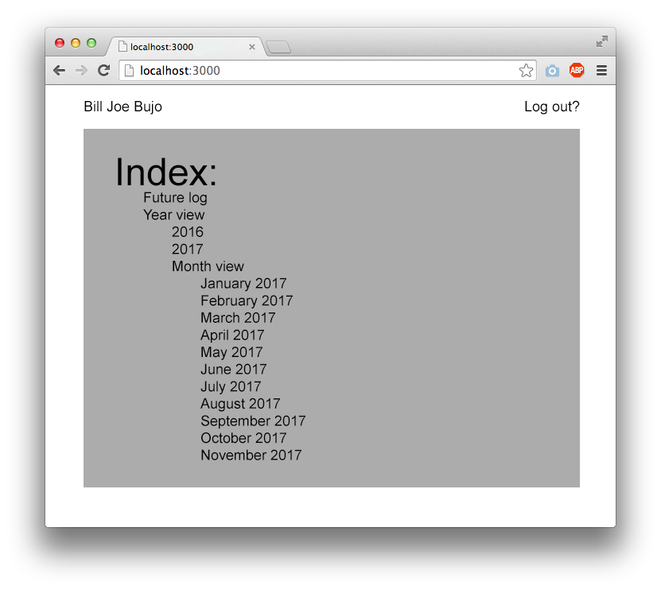
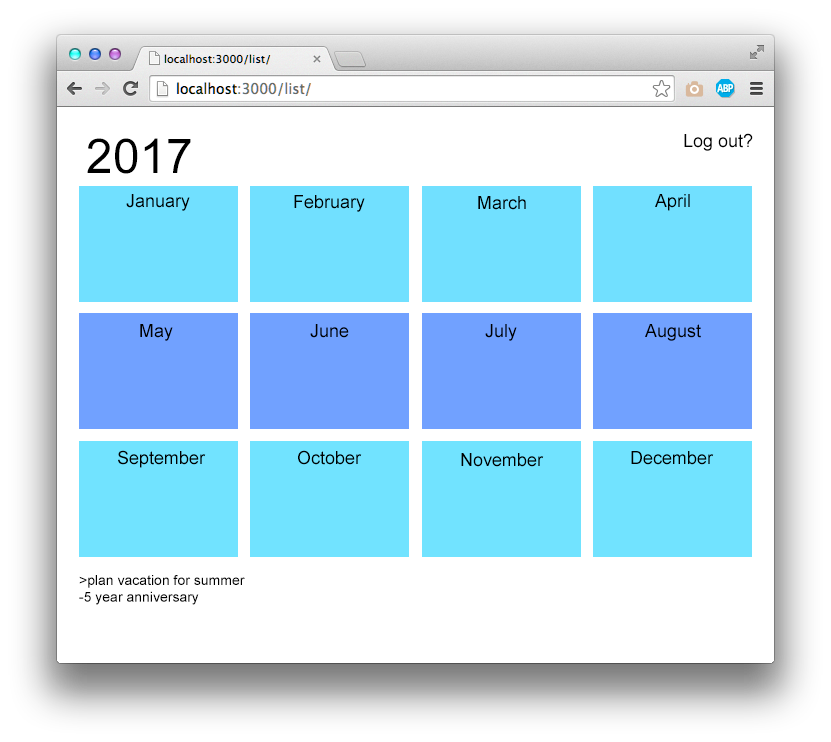
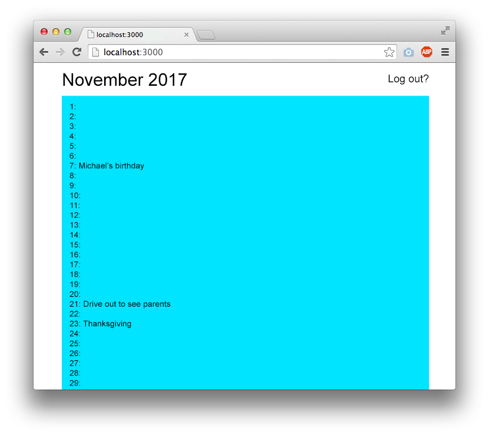
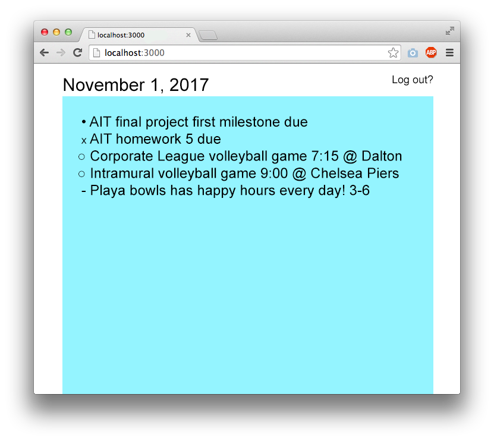
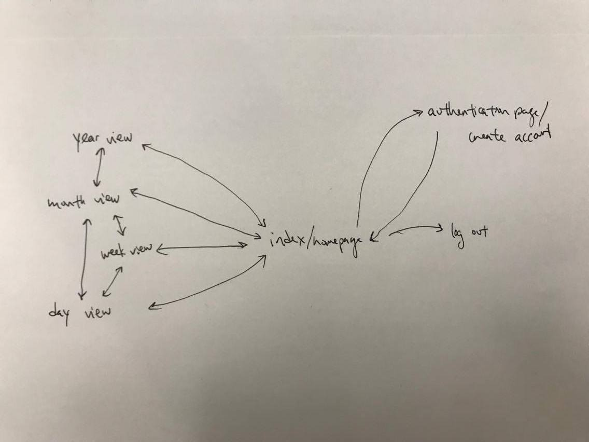

# Online Bullet Journal 

## Overview

Bullet journals (bujo) have recently become a popular phenomenon, a way to get organized but also to express yourself. People use them as sketch books, diaries, to-do lists, and more. A quick search for bujo on Instagram reveals how diverse and widespread they have become. You can read more about bullet journals here: bulletjournal.com

For those of us who are not naturally organized, it may be difficult to adjust and update a bujo on the daily. By making a digital version, users can be reminded to use their journals with the added convenience of being having a virtual journal: no need to buy or maintain a physical journal, integration with other useful tools like Google Calendar, and daily notifications to keep you accountable.

For this project, a complete virtual bullet journal is out of scope, but I will be attempting a prototype of one.

## Data Model

This application will store Users and their Pages, which will in turn contain Tasks, Events, and Notes: 

* users can have multiple page (via embedding) and a choice of theme
* each page can have multiple items (by embedding)

An Example User:

```javascript
{
  username: "billjoebujo",
  hash: // a password hash,
  pages: [Page], // an array of Page documents
  theme1: Boolean,  //themes are Booleans to better work with Handlebars
  theme2: Boolean 
}
```

An Example Page with Example Embedded Items:

```javascript
{
  title: String
  tasks: [
      {content: "Plan vacation for summer", incomplete: true, inprog: false, completed: false}
      {content: "Visit Ashley", incomplete: false, inprog: true, completed: true}
  ],
  events: [
      "May 3rd: 5th anniversary"
  ], 
  notes: [
      "Noticed more beetles this year in the garden"
  ]
}
```

## [Link to Commented Schema](./src/db.js) 

This is the full schema, feel free to hit history to see how much it has changed.

## Original Wireframes - Out of Date

/ - page for navigation



/year - page for showing a year view



/year/month - page for showing a month view



/year/month/week - page for showing a week view



## Site Map - Out of Date



## User Stories or Use Cases

1. as non-registered user, I can register a new account with the site
2. as a user, I can log in to the site
3. as a user, I can choose a theme for my site that suits my tastes
4. as a user, I can add new note pages
5. as a user, I can add tasks, events, and notes to each of my pages
6. as a user, I can update my tasks to keep track of my progress

## Research Topics

* (5 points) Integrate user authentication
    * I'm going to be using passport for user authentication
* (3 points) Use a CSS framework throughout my site
    * I'm going to create several Bootstrap themes and allow users to choose between theme
    * My Bootstrap themes will have some customization and will be minified

8 points total out of 8 required points

## [Link to Main Project File](app.js) 

Created an Express application with Handlebars as my templating library.

## Annotations / References Used

* [passport.js authentication tutorial](https://scotch.io/tutorials/easy-node-authentication-setup-and-local) - (add link to source code that was based on this)
